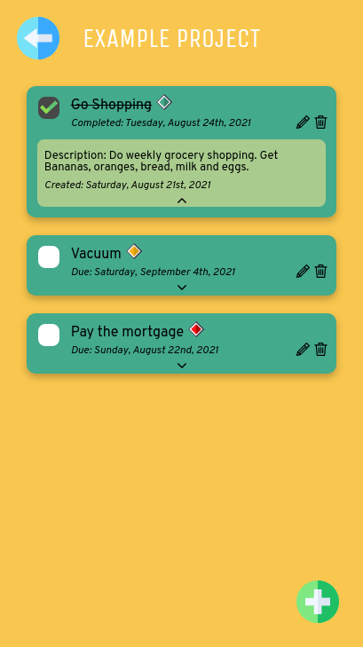

<!--
*** Thanks for checking out the Best-README-Template. If you have a suggestion
*** that would make this better, please fork the repo and create a pull request
*** or simply open an issue with the tag "enhancement".
*** Thanks again! Now go create something AMAZING! :D
***
***
***
*** To avoid retyping too much info. Do a search and replace for the following:
*** craigmclean39, todo-top, twitter_handle, craig.mclean39@gmail.com, Tasky: The Todo List, A Todo list web app that is part of The Odin Project Full Stack Javascript curriculum.
-->

<!-- PROJECT SHIELDS -->
<!--
*** I'm using markdown "reference style" links for readability.
*** Reference links are enclosed in brackets [ ] instead of parentheses ( ).
*** See the bottom of this document for the declaration of the reference variables
*** for contributors-url, forks-url, etc. This is an optional, concise syntax you may use.
*** https://www.markdownguide.org/basic-syntax/#reference-style-links
-->
<!-- [![Contributors][contributors-shield]][contributors-url]
[![Forks][forks-shield]][forks-url]
[![Stargazers][stars-shield]][stars-url]
[![Issues][issues-shield]][issues-url]
[![MIT License][license-shield]][license-url]
[![LinkedIn][linkedin-shield]][linkedin-url] -->

<!-- PROJECT LOGO -->
 

  

  <h3 align="center">Tasky: The Todo List</h3>

  

    A todo list webpage that was created as part of The Odin Project Full Stack Javascript curriculum.
     
    <a href="https://github.com/craigmclean39/todo-top"><strong>Explore the docs »</strong></a>
     
     
    <a href="https://craigmclean39.github.io/todo-top/">View Demo</a>
    ·
    <a href="https://github.com/craigmclean39/todo-top/issues">Report Bug</a>
    ·
    <a href="https://github.com/craigmclean39/todo-top/issues">Request Feature</a>
  

<!-- TABLE OF CONTENTS -->

  
<h2 style="display: inline-block">Table of Contents</h2>

  <ol>
    <li>
      <a href="#about-the-project">About The Project</a>
      <ul>
        <li><a href="#built-with">Built With</a></li>
      </ul>
    </li>
    <li>
      <a href="#getting-started">Getting Started</a>
    </li>
    <li><a href="#features">Features</a></li>
    <li><a href="#contact">Contact</a></li>
    <li><a href="#acknowledgements">Acknowledgements</a></li>
  </ol>

<!-- ABOUT THE PROJECT -->

## About The Project

### Built With

- [JavaScript](https://developer.mozilla.org/en-US/docs/Web/JavaScript)
- [CSS](https://developer.mozilla.org/en-US/docs/Web/CSS)

<!-- GETTING STARTED -->

## Getting Started

Take a look at the demo <a href="https://craigmclean39.github.io/todo-top/">here.</a>

<!-- USAGE EXAMPLES -->

## Features

Tasky currently has the following features:

- The ability to add seperate projects, which is equivalent to starting a new todo list.
- Projects can have Tasks added to them, Tasks include a title and description, a due date, and a priority level.
- Tasks can be edited or deleted.
- Tasks can be completed. When completed their completion date is shown.

<!-- CONTACT -->

## Contact

Craig McLean - craig.mclean39@gmail.com

Project Link: [https://github.com/craigmclean39/todo-top](https://github.com/craigmclean39/todo-top)

<!-- ACKNOWLEDGEMENTS -->

## Acknowledgements

- [The Odin Project](https://www.theodinproject.com/)
- [flaticon](https://www.flaticon.com/)
- [coolers](https://coolors.co/)
- [figma](https://www.figma.com/)
